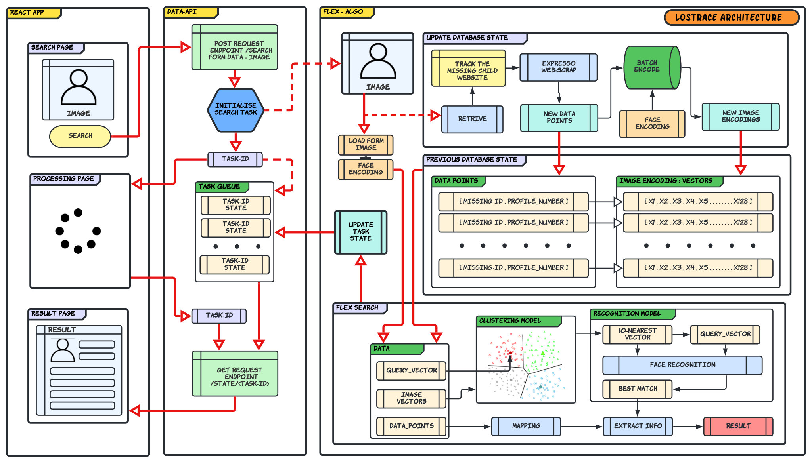

# Lostrace-Data-API

## Data API Documentation 

### POST /search                                                                  
    Form-Data                                                                 
      - Image : file                                                          
      - Mode  : 0 ( Real-Dataset  )                                            
                1 ( Dummy-Dataset )                                           
    Returns                                                                       
    { Task : URL(/state/<Task_id>) }  

### GET /search/<Task_id>                                                         
    Returns                                                                       
    { 'Phase':<_>, 'Info':<_> }                                               
    - Phase: Success      Info : Person-Details (Dictionary)                  
    - Phase: Process      Info : Current Running Process (String)             
    - Phase: Failure      Info : Error Message (String)                       
                                                                              
    * Personal-Details :                                                      
              {                                                               
                 Img (image_link)                                             
                 Report_link ( Redirects to Report Page )                     
                 Profile_link ( Redirects to Full Profile Page )              
                 Name                                                         
                 Current_Age                                                  
                 Gender                                                       
                 Father_Name                                                  
                 Place_of_Missing                                             
                 Date_of_Missing                                              
               }                                                              
                                                                              
    * Current Running Process :                                               
               - 'Fetching New Data'                                          
               - 'Encoding New Data'                                          
               - 'Updating Database State'                                    
               - 'Flex Searching Image'                                       
                                                                              
    * Error Message :                                                         	
               - 'No Image Uploaded'                                          
               - 'No Face Detected'                                           
               - 'Person Not Found' 

## Data API Flow

